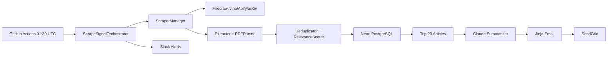

# ScrapeSignal Architecture

Pipeline:

The database layer uses SQLAlchemy 2.0 async sessions and PostgreSQL indexes for
the common relevance-score and email-sent queries. External network calls use
`httpx.AsyncClient` with explicit timeouts and retry wrappers.

The schema has six primary tables:

- `articles`
- `dedup_hashes`
- `source_configs`
- `keywords_master`
- `scrape_logs`
- `email_logs`
